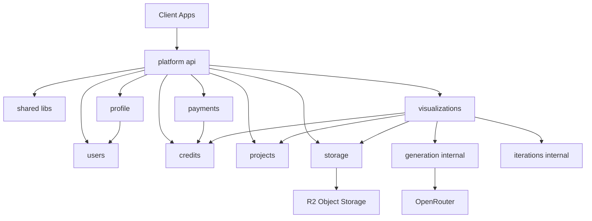
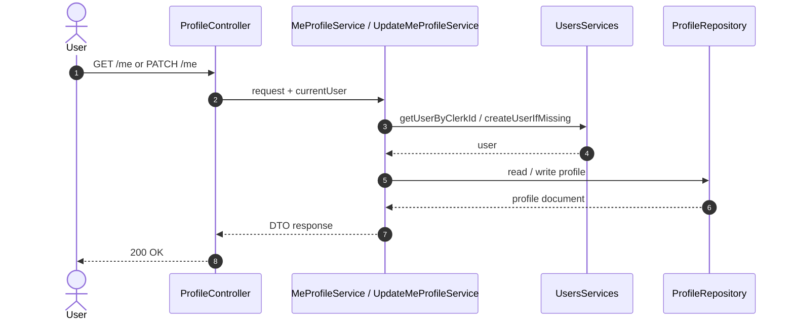
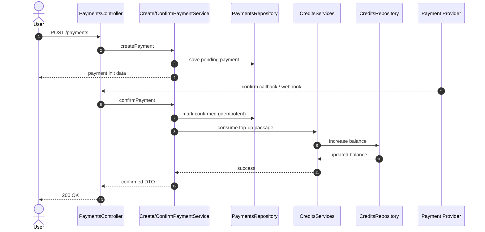
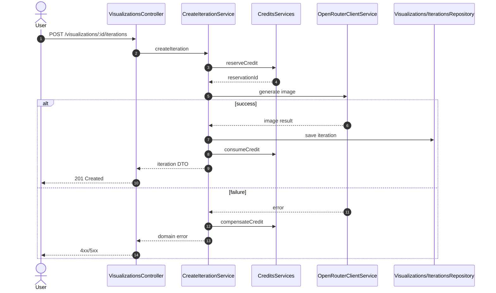

# Application Blueprint: platform-api (NestJS Modular Monolith)

## 1. Architectural assumptions (final decisions)

- Style: **Modular Monolith** in NestJS.
- Inter-module communication: **synchronous**, via module imports and public service calls.
- Module encapsulation:
  - modules can export **services only**,
  - repositories and schemas are not exported.
- `iterations` and `generation` are internal parts of the `visualizations` module.
- `POST /projects/{projectId}/visualizations` creates visualization metadata only (no first-iteration generation).
- `POST /visualizations/{visualizationId}/iterations` is the only endpoint that creates iterations.
- Backend does not expose an endpoint to set active iteration; active iteration context is managed in frontend state.
- API contract mapping is done **in services**.

---

## 2. Target folder structure (Tree structure)

```text
apps/platform-api/
  src/
    app.module.ts
    main.ts

    config/
      config.module.ts

    database/
      database.module.ts

    shared/
      libs/
        auth/
          auth.guard.ts
          auth.types.ts
          index.ts
        pipes/
          zod-validation.pipe.ts
        interceptors/
          response-logging.interceptor.ts
        decorators/
          current-user.decorator.ts
        errors/
          app-error.filter.ts
        constants/
          module-tokens.ts

    modules/
      users/
        users.module.ts
        users.repository.ts
        user.schema.ts
        services/
          get-user-by-clerk-id.service.ts
          create-user-if-missing.service.ts

      profile/
        profile.module.ts
        profile.dto.ts
        me.controller.ts
        services/
          me-profile.service.ts
          update-me-profile.service.ts

      credits/
        credits.module.ts
        credits.schema.ts
        credits.repository.ts
        credits.controller.ts
        credits.dto.ts
        services/
          get-balance.service.ts
          reserve-credit.service.ts
          consume-credit.service.ts
          compensate-credit.service.ts

      payments/
        payments.module.ts
        payments.schema.ts
        payments.repository.ts
        payments.controller.ts
        payments.dto.ts
        services/
          create-payment.service.ts
          confirm-payment.service.ts
          cancel-payment.service.ts

      projects/
        projects.module.ts
        project.schema.ts
        projects.repository.ts
        projects.controller.ts
        projects.dto.ts
        services/
          create-project.service.ts
          list-projects.service.ts
          update-project.service.ts
          delete-project.service.ts

      visualizations/
        visualizations.module.ts
        visualizations.controller.ts
        visualizations.dto.ts

        repositories/
          visualizations.repository.ts
          iterations.repository.ts

        schemas/
          visualization.schema.ts
          iteration.schema.ts

        services/
          create-visualization.service.ts
          get-visualization-details.service.ts
          list-project-visualizations.service.ts

        generation/
          services/
            generate-iteration-image.service.ts
            openrouter-client.service.ts
            prompt-builder.service.ts

        iterations/
          services/
            create-iteration.service.ts
            list-iterations.service.ts

      storage/
        storage.module.ts
        storage.dto.ts
        storage.controller.ts
        services/
          sign-download-url.service.ts

```

> Note: the current `profile` module remains, but it should use `users` as the user data source.

### Mermaid: module dependencies (high-level)



---

## 3. Module responsibilities

### `users`

- Maintains local user data (linked to Clerk `userId`).
- Exposes user read/create services for other modules.
- Does not contain payment/project/visualization business logic.

### `profile`

- Handles `/me` endpoints and profile updates.
- Validates DTO input (nest-zod).
- Services map Mongo documents to API response contracts.

### `credits`

- Owns balance and credit operations.
- Implements the **reservation + compensation** pattern synchronously.
- Is the only module allowed to mutate credit balance.

### `payments`

- Integrates package purchase and payment confirmation flow.
- Calls `credits` services synchronously after confirmation.
- Stores payment statuses and idempotency key.

### `projects`

- Provides CRUD for user projects.
- Enforces per-user data isolation.
- Does not contain image-generation logic.

### `visualizations`

- Public workspace module for visualizations.
- Contains internal parts:
  - `generation/` (generation via OpenRouter),
  - `iterations/` (iteration history and creation).
- `GET /visualizations/{visualizationId}` always returns visualization details with full iterations list.
- `GET /visualizations/{visualizationId}/iterations` can be used as lightweight paginated iteration history endpoint.
- `POST /projects/{projectId}/visualizations` creates empty visualization (without generation).
- `POST /visualizations/{visualizationId}/iterations` is the only write endpoint for new iterations.
- Orchestrates:
  1. credit reservation (calling `credits`),
  2. generation,
  3. credit finalization or compensation on failure.

### `storage`

- Exposes only signed download URL endpoint for user-owned assets.
- Upload flow is handled through `visualizations` iteration creation endpoint.
- Does not contain project or payment logic.

### `shared`

- Global technical functionality: auth guards, pipes, interceptors, decorators, error filters.
- No domain logic.

---

## 4. Dependency rules and circular dependency avoidance

1. Modules import each other only via `Module` and use **public services**.
2. Repositories and schemas are private to a module (no exports).
3. Cross-module flows are implemented through application services.
4. `forwardRef` is allowed only as an emergency option; target state is unidirectional relationships.
5. Shared technical utilities should live in `shared/libs/*` instead of domain-module cross-imports.

---

## 5. Naming standards and conventions (NestJS)

## 5.1 Modules and files

- Module: `<feature>.module.ts`
- Controller: `<feature>.controller.ts`
- DTO: `<feature>.dto.ts`
- Repository: `<feature>.repository.ts`
- Mongoose schema: `<entity>.schema.ts`
- Use-case service: `<verb>-<entity>.service.ts` (e.g., `create-project.service.ts`)

## 5.2 Types and TypeScript style

- Types with `T` prefix (e.g., `TUser`, `TCreditReservation`).
- Prefer `type` over `interface`.
- Use arrow functions.
- Group parameters in objects (no destructuring in function signatures).

## 5.3 Guards, Pipes, Decorators, Interceptors

- Guard: `<name>.guard.ts` + `@UseGuards(AuthGuard)` decorator for protected endpoints.
- Pipe: `<name>.pipe.ts` (e.g., `zod-validation.pipe.ts`).
- Decorator: `<name>.decorator.ts` (e.g., `current-user.decorator.ts`).
- Interceptor: `<name>.interceptor.ts` (e.g., `response-logging.interceptor.ts`).
- Exception filter: `<name>.filter.ts`.

## 5.4 DTO and API contracts

- Controller input/output is defined by Zod schemas (`nest-zod`).
- Services are responsible for mapping Mongoose documents to DTO/Zod contracts.
- No excessive mapper layer in MVP.

---

## 6. Example synchronous flow: new iteration

1. `VisualizationsController` receives the request.
2. `create-iteration.service` calls `reserve-credit.service` from `credits`.
3. `openrouter-client.service` generates the image.
4. On success: save iteration + call `consume-credit.service`.
5. On failure: call `compensate-credit.service`.
6. Service returns the API response contract.

### Mermaid: flow 1 — user profile (`GET /me`, `PATCH /me`)



### Mermaid: flow 2 — payment and credit top-up



### Mermaid: flow 3 — visualization generation (reservation + compensation)



---

## 7. Migration plan for current `platform-api` state (short)

1. Organize `profile` (remove duplicate `me-profile.service.ts`, keep the version in `services/`).
2. Add modules: `credits`, `payments`, `projects`, `visualizations`, `storage`.
3. Create internal folders in `visualizations`: `generation/` and `iterations/`.
4. Remove active-iteration selection use case from `visualizations`.
5. Keep `storage` public API limited to signed download URL endpoint.
6. Handle upload only in `POST /visualizations/{visualizationId}/iterations` flow.
7. Add global technical elements to `shared/libs`.
8. Wire dependencies only through module service exports.
